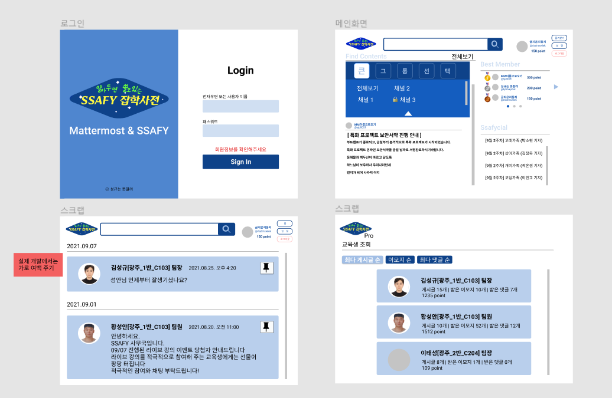
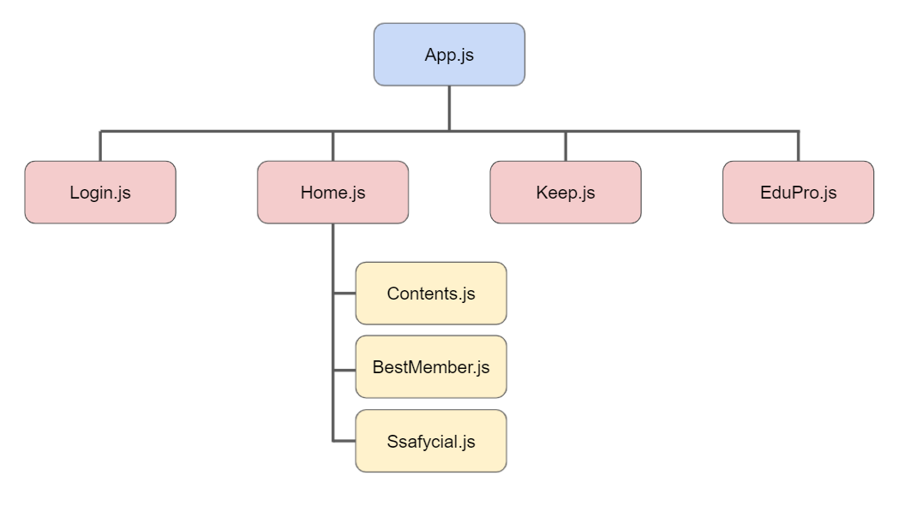
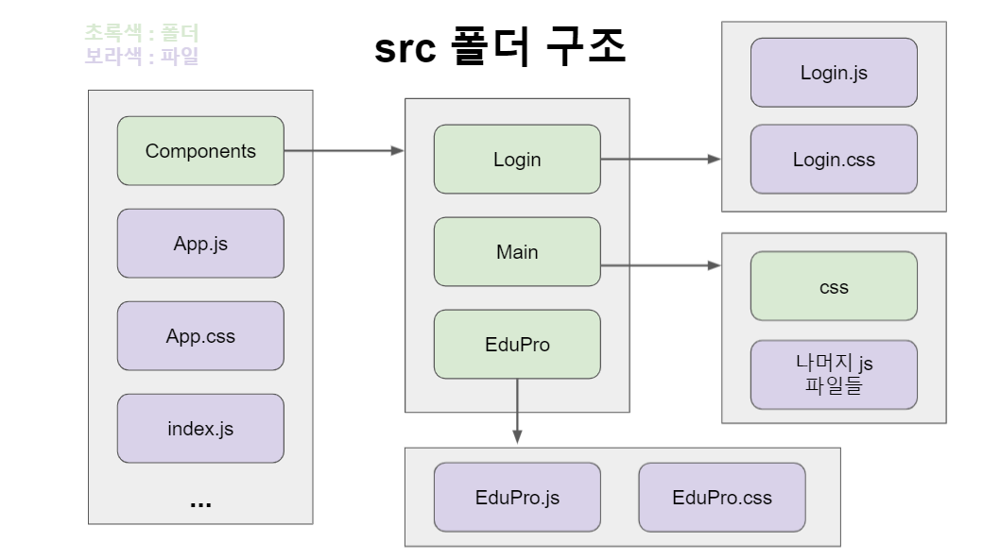
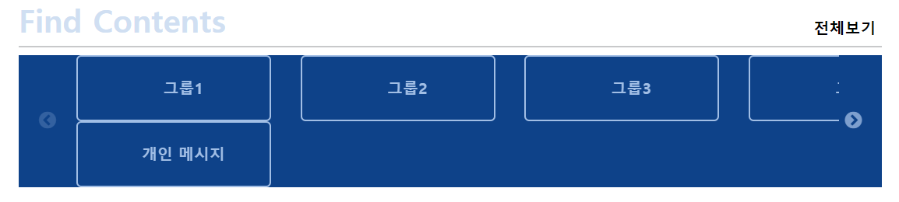
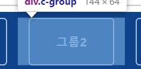
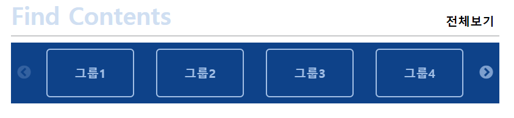
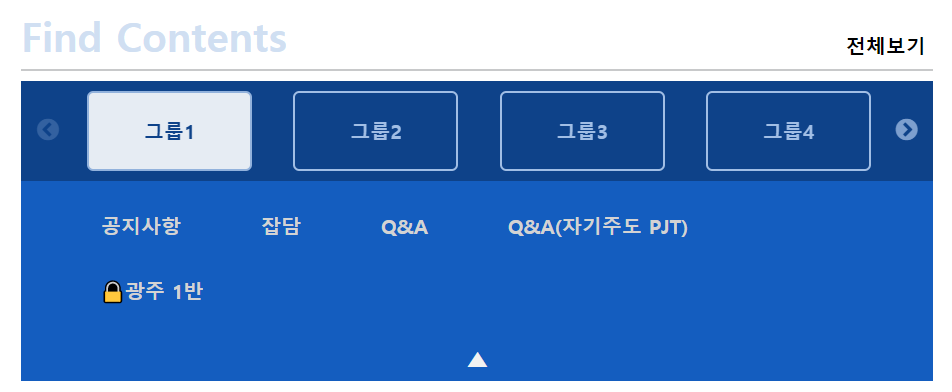
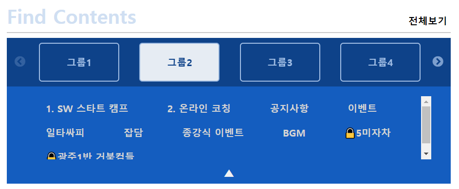
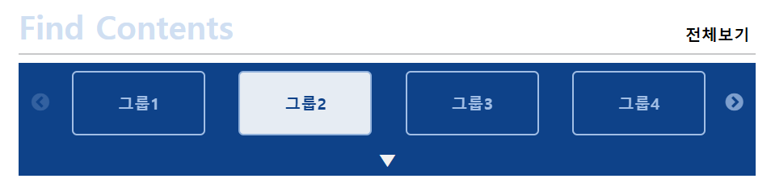

[toc]

- 메인 - 반응형 화면 캡쳐
- 게시글 탐색 - 2중 Navigation바 스크롤바 커스텀 캡쳐


# 시작하기

## 프로토타입




## 컴포넌트 구성






# 로그인

## 로그인 실패 경고창

- 삼항연산식을 이용하여 경고창 className으로 할당

  ```react
  // Login.js
  
  alertClassName() {
      var alert  = this.state.alert
      return alert === false ? 'login-alert' : 'login-alert-view'
    }
  
  return (
      <div className={this.alertClassName()}>
          <h5>회원정보를 확인해주세요</h5>
      </div>
  )
  ```

  ```css
  /* Login.css */
  
  .login-alert {
      visibility: hidden;  // div 공간 주기 위해 visibility 사용
  }
  
  .log-alert-view {
      display: flex;
      ...
  }
  ```

  

## 엔터키로 로그인 실행

- 엔터키 눌렀을 때, 로그인 실행시키기

  ```react
  // Login.js
  
  componentDidMount() {
      document.addEventListener("keyup", (e) => {  
          if (e.keyCode === 13) {
              this.onClickLogin()  // 로그인 실행 함수
          }
      })
  }
  ```


# 메인

## sessionStorage에 있는 값 가져오기

- `string`으로 되어있는 데이터를 `JSON`형태로 파싱해서 

  `state`에 입력하여 사용!

  ```react
  // Home.js
  
  takeUserInfo = () => {
      if (JSON.parse(sessionStorage.getItem('userInfo'))) {
          const userInfo = JSON.parse(sessionStorage.getItem('userInfo'))
          this.setState({nickname: userInfo.nickname})
          this.setState({username: userInfo.username})
      }
  }
  
  componentDidMount() {
      this.takeUserInfo()
  }
  ```


## 반응형 화면

- 너비가 992px미만이면, 모바일 화면으로 전환

  ```css
  /* Home.css */
  
  @media (max-width: 992px) {
      ...
  }
  ```

  -- 화면 캡쳐--


# 베스트 멤버

## Slider

- `react-slick` 이용하여 `carousel` 구현

  - 설치하기

  ```bash
  $ npm install react-slick --save  
  ```

  ```bash
  $ npm install slick-carousel --save  
  ```

  

  - 반드시 위에 `import` 해줘야함!!

  ```react
  import React, { Component } from "react";
  import Slider from "react-slick";
  import 'slick-carousel/slick/slick.css';
  import 'slick-carousel/slick/slick-theme.css';
  ```

  

  - 코드

  ```react
  class BestMemeber extends Component {
      ...
      render() {
          ...
          const settings = {  
              // 슬라이드 옵션들
              arrows: false,
              dots: true,
              infinite: true,
              speed: 500,
              slidesToShow: 1,
              slidesToScroll: 1,
              autoplay: true,
              autoplaySpeed: 3000,
          };
          
          return (
          	<div>
              	...
                  <Slider {...settings}>
                      // div에 슬라이드 각 페이지 구현
                  	<div>...</div>
                      <div>...</div>
                      <div>...</div>
                  </Slider>
              </div>
          )
      }
  }
  ```
  


# 게시글 탐색

## 큰 그룹 Slider

😂 `react-slick` 이용하여 `carousel` 구현 중, 각 `item`들이 붙어있는 현상 발생!!

`.slick-slider`와 `.slick-slide`에 `margin`을 주어서 해결하려고 했더니,

아이템들이 정돈되지 않은 상태로 나타남..




💡 slide 아이템 안에 `div`를 만들어서 `가운데로 정렬`을 해보는 생각을 함!




- 코드

  ```react
  // Contents.js
  
  class Contents extends React.Component {
      state = {
          "Group": [],
          ...
      }
          
      render() {
          const { Group } = this.state
          
          const settings = {
            infinite: false,
            arrows: true,
            speed: 500,
            slidesToShow: 4,
            slidesToScroll : 1,
            draggable: false,
          }
          
        	// 그룹 이름
        	const groupName = Group.map((name) => 
            <div className="c-group">
              <div className="group-title" onClick={this.onClickGroup}>{ name }</div>
            </div>
          );
                                      
          return (
            <div className="c-nav">
                <Slider className="c-slider" {...settings}>
                  { groupName }
                </Slider>
            </div>
          )
      }
  }
  ```

  ```css
  /* Contents.css */
  
  .c-group {
    width: 100%;
  }
  
  .group-title {
    width: 80%;
    border-radius: 5px;
    border: 2px solid #A1BEE5;
    color: #A1BEE5;
    font-weight: bold;
    display: flex;
    justify-content: center;
    align-items: center;
    height: 4rem;
    margin-left: 10%;  /* 가운데 정렬을 위한 margin */
    padding: 0 1rem;
    overflow-y: hidden;
  }
  ```




## 2중 Navigation바

- 그룹을 클릭하면, 클릭된 그룹의 채널들 제시 

  (+ 채널이 너무 많으면, 스크롤바 제공)

  

  - 버튼 클릭 함수

  ```react
  // Contents.js
  
  onClickGroup = (e) => {
      // state에 선택한 그룹의 채널들 넣기
      var v = e.target.innerText
      this.setState({
        "ChkChannel": this.state.Channel[v]
      })
  
      // 버튼 취소
      if (document.querySelector(".group-chk")) {
        document.querySelector(".group-chk").classList.remove("group-chk")
      }
      // 버튼 체크
      e.target.classList.add("group-chk")
  
      // 채널 nav바 보이기
      document.querySelector(".nav-down").classList.add("nav-none")
      document.querySelector(".sub-nav").classList.remove("nav-none")
  }
  ```

  ```css
  /* Contents.css */
  
  .group-chk {
    background-color: #fff;
    color: #0E4289;
    opacity: 0.9;
  }
  
  .nav-none {
    display: none;
  }
  ```

  




- 화살표를 클릭하면, 채널 Navigation바 숨김 & 보임

  ```react
  // Content.js
  
  onClickNavArrow = (e) => {    
      if (e.target.className === "nav-down") {
        document.querySelector(".nav-down").classList.add("nav-none")
        document.querySelector(".sub-nav").classList.remove("nav-none")
      }
      if (e.target.className === "nav-up") {      
        document.querySelector(".sub-nav").classList.add("nav-none")
        document.querySelector(".nav-down").classList.remove("nav-none")
      } 
  }
  ```

  ```react
  // Content.js => render
  
  <div className="c-nav">
      ...
      <div className="nav-down nav-none" onClick={this.onClickNavArrow}>
          ▼
      </div>
  </div>
  <div className="sub-nav nav-none">
      ...
      <div className="nav-up" onClick={this.onClickNavArrow}>
          ▲
      </div>
  </div>
  ```



훌륭한 은지
