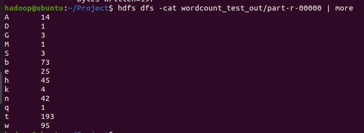
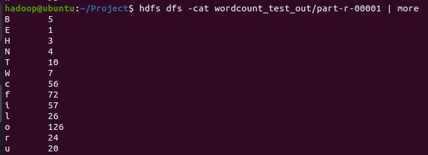

## 특화PJT - 광주 1반 3팀 빅데이터#2(분산처리)

## 하둡이란?

하둡이란, 더그 커팅이 대용량의 비정형 데이터를 기존의 RDM 기술로 처리가 힘들다는 것을 깨닫고 새로운 기술을 찾는 중 구글에서 발표한 GFS와 MapReduce 관련 논문을 참고하여 개발된 프레임워크이다.

하나의 성능 좋은 컴퓨터를 이용하여 데이터를 처리하는 대신, 적당한 성능의 범용 컴퓨터 여러 대를 클러스터화하고 큰 크기의 데이터를 클러스터에서 병렬로 동시에 처리하여 처리 속도를 높이는 것을 목적으로 하는 분산처리를 위한 오픈소스 프레임워크이다.

하둡은 분산시스템인 HDFS에 데이터를 저장하고, 맵리듀스를 이용해 데이터를 처리한다.

## HDFS(Hadoop Distributed File System)

빅데이터 파일을 여러 대의 서버에 분산 저장하기 위한 파일시스템이다.

여러 대의 서버에 데이터를 저장하고, 저장된 각 서버에서 동시에 데이터를 처리하는 방식이다.

## 맵리듀스란? (Map + Reduce)

각 서버에서 데이터를 분산처리하는 분산병렬처리를 위한 분석시스템이다.

Map: 흩어져 있는 데이터를 (key, value) 형태로 연관성 있는 데이터 분류로 묶는 작업

Reduce: Filtering과 Sorting을 거쳐서 데이터를 추출하고 Map화한 작업 중 중복 데이터를 제거하고 원하는 데이터를 추출하는 작업

# Result

- Wordcount1char

  

  