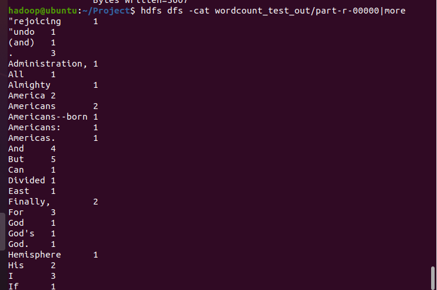
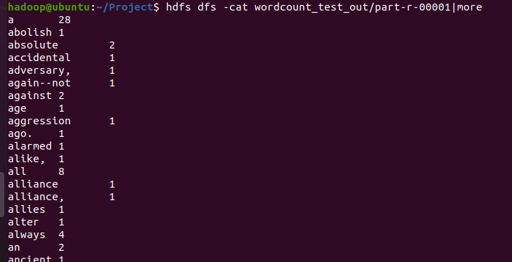

## Wordcountsort 과제

1. cd /home/Project/src에 들어가서 `Wordcount.java` 파일을 복사하여서 `Wordcountsort .java` 파일로 복제한다.

   ```
   cp Wordcount.java Wordcountsort .java
   ```

2. class 이름을 `Wordcountsort ` 로 변경 후, 첫 글자가 대문자인 경우 0을 리턴하고 그 외에 1을 리턴하는 class를 만들어준다.

   ```java
   public static class MyPartitioner extends Partitioner<Text, IntWritable> {
           @Override
           public int getPartition(Text key, IntWritable value, int numPartition) {
               if (key.toString().charAt(0) < 'a') return 0;
               else return 1;
           }
       }
   ```

3. main 함수에서 `setJarByClass` 안에 변수를 `Wordcountsort`로 변경해주고, `setPartitionerClass`를 `MyPartitioner.class`로 설정해준다.

   ```java
   job.setJarByClass(Wordcountsort.class);
   
   job.setPartitionerClass(MyPartitioner.class);
   ```

4. `Driver.java` 파일에 새로 코딩한 자바 프로그램을 등록해준다.

   ```java
   pgd.addClass("wordcountsort", Wordcountsort.class, "2st");
   ```

5. /home/Project 경로에서 `ant` 명령어로 컴파일 해준다.

6. 테스트 데이터를 HDFS에 넣는다.

   ```
   cd /home/hadoop/Project
   hdfs dfs -mkdir wordcount_test
   hdfs dfs -put data/wordcount-data.txt wordcount_test
   
   # 결과를 저장할 디렉토리가 있을 경우 삭제한 후 프로그램을 실행한다.
   hdfs dfs -rm -r wordcount_test_out
   
   # 실행
   hadoop jar ssafy.jar wordcountsort wordcount_test wordcount_test_out
   
   # 결과보기 (reduct 개수에 따라 00000~ 에 대한 개수가 달라짐)
   hdfs dfs -cat wordcount_test_out/part-r-00000 | more
   ```

   


# Result



