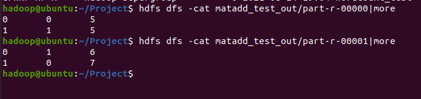

## 특화PJT - 광주 1반 3팀 빅데이터#2(분산처리)

## InvertedIndex

> 각 문서 안에 있는 단어가 어는 문서에 몇 번째에 있는지 위치를 표현되어야 한다.


### Map (key, value) = (단어 이름, 문서 이름:위치(offset))

- Mapper

  ```java
  public static class TokenizerMapper extends Mapper<Object,Text,Text,Text> 
  ```

  Mapper<Object,Text,Text,Text> => <입력 key 타입, 입력 value 타입, 출력 key 타입, 출력 value 타입>

- 파일이름

  ```java
  protected void setup(Context context) throws IOException, InterruptedException {
  				filename = ((FileSplit)context.getInputSplit()).getPath().getName();
  			}	
  ```

  현재 사용하는 파일 이름을 뽑아서 저장하는 함수이다.

- logic

  ```java
  public void map(Object key, Text value, Context context)
      throws IOException, InterruptedException {
  
      StringTokenizer itr = new StringTokenizer(value.toString());
      long p = ((LongWritable)key).get();
      while ( itr.hasMoreTokens() ) {
          String token = itr.nextToken();
          word.set(token.trim());
          if (!token.equals(" ")) {
              pos.set(filename + ":" + p);
              context.write(word, pos);
          }
          p += token.length();
      }
  }
  ```

  `StringTokenizer(String str)`: 전달된 str을 기본 delim으로 분리한다. 기본 delimiter는 공백 문자들인 "\t\n\r\t"이다. 

  `(Long(Writable)key).get()`:  파일에서 현재 라인의 시작 위치의 byte offset을 가져온다.


### Reduce

>  분류해 놓은 값들을 합치는 과정

```java
public void reduce(Text key, Iterable<Text> values, Context context) throws IOException, InterruptedException {
			String s = new String();
			int comma = 0;
			for (Text val: values) {
				if (comma == 0) {
					comma = 1;
					s += (":" + val.toString());
				}
				else {
					s += ("," + val.toString());
				}
			}
			list.set(s);
			context.write(key,list);
		
		}
```

values를 돌면서 첫 번째로 나온 value인 경우에 ':'를 붙여주고, 그 다음부터는 "," 를 붙여주어서 다음과 같이 출력되도록 한다.

> key: 파일이름:위치, 파일이름:위치, ...


### main

지금까지 output이 저장되는 디렉토리를 삭제했었다.

> hdfs dfs -rm -r 결과디렉토리

하지만, 다음과 같은 코드를 추가하면 일일이 삭제하지 않아도 실행할 때마다 output이 저장되는 디렉토리가 자동으로 삭제된다.

```java
FileSystem hdfs = FileSystem.get(conf);
Path output = new Path(otherArgs[1]);
if (hdfs.exists(output))
    hdfs.delete(output, true);
```


## MatrixAdd


두 행렬의 데이터가 `Map`함수를 통해 `(key, value) => ((행,열), value)` 형태로 바뀌게 되고,

이 데이터가 shuffling을 통해 같은 (행, 열)에 있는 갓들을 list로 모아준다. 

그 후, `Reduce` 함수로 list 안의 값을 sum해주게 된다.


- Map

  ```java
  public void map(Object key, Text value, Context context)
  	throws IOException, InterruptedException {
  	
        	String[] arr = value.toString().split("\t");
          Text emitkey = new Text (arr[1] + "\t" + arr[2]);
          IntWritable emitval = new IntWritable (Integer.parseInt(arr[3]));
          context.write(emitkey, emitval);
  }
  ```

- Reduce

  ```java
  public void reduce(Text  key, Iterable<IntWritable> values, Context  context) 
  	throws IOException, InterruptedException {
  		int sum = 0;	
  		for (intWritable val : values) {
  			sum += val.get();
  		}
  		context.write(key, new intWritable(sum));
  
      }
  ```

  


## Result

- InvertedIndex

  

  

  


- MatAdd

  